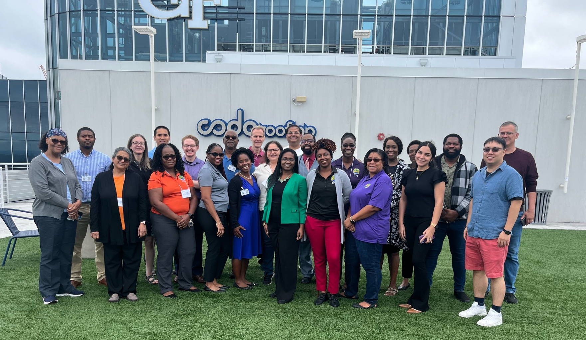

# Overview

The [South Big Data Hub](https://southbigdatahub.org/) in collaboration with the [CODATA-RDA Schools of Research Data Science](https://www.datascienceschools.org/), and [AIM-AHEAD Southeast Hub at Morehouse School of Medicine](https://aim-ahead.net/) is hosting an 8-week Researcher Data Science Training through a mix of virtual and in-person instruction. This will be the first CODATA-RDA School run in the United States and will include teams from universities with the AIM-AHEAD Southeast Hub. The SMART-DART: Health Equity Cohort will focus on growing the competence of Health Equity researchers in accessing, analyzing, visualizing, and publishing data. It is open to participants from minority-serving institutions (MSIs), described in eligibility below. This activity will cover topics on principles and practice of Open Science, research data management and curation, use of a range of research compute infrastructures, large-scale analysis, statistics, visualization and modeling techniques, automation, and scripting.

Learn more about the CODATA/RDA Schools or [Research Data Science](https://www.datascienceschools.org/). 

## Schedule

This links will be updated at the end of the previous week (Friday or Sunday). 

### Table of contents
1. [Week 1: In-person sessions](#w1)
2. [Week 2: Unix and Git](#w2)
3. [Week 3: R](#w3)
4. [Week 4: ML and Recommender Systems](#w4)
5. [Week 5: Neural Networks](#w5)
6. [Week 6: Visualization](#w6)
7. [Week 7: Information Security](#w7)
8. [Week 8: Computational Structures](#w8)
9. [Important Links](#links)
10. [Contacts](#contacts)
11. [Additional Materials](#+materials)

### Week One - September 14-15 - In-person sessions 
   * Check your travel arrangements with Carolyn.Young@gtri.gatech.edu

| Time           | Session                        | Materials |
|----------------|--------------------------------|-----------|
| September 14th |                                |           |
| 8:30 - 9:00    | Gathering and Breakfast        | Breakfast Provided | 
| 9:00 - 9:45    | Intro and welcome              |           |
| 9:45 - 10:15   | Author Carpentry               | [Link](https://malfaro2.github.io/Atlanta2022/AuthorCarpentry.html#/title-slide)  |
| 10:15 - 10:30  | Coffee break                   |           |
| 10:30 - 12:00  | Open and Responsible Research  | [Link](OpenScience_EthicsATL2023.pdf)  |
| 12:00 - 13:00  | Lunch Break                    | Lunch Provided |
| 13:00 - 14:30  | Open and Responsible Research  | [Link](OpenScience_EthicsATL2023.pdf)  |
| 14:30 - 17:30  | Research Data Management       | [Link](RDM_Diggs.pdf)  |
| 17:30          | Group Dinner - Optional        | Dinner Not-Provided |
| September 15th | 
| 8:30 - 9:00    | Gathering and Breakfast        | Breakfast Provided |
| 9:00 - 10:15   | Research Data Management - Presentations | [Link](https://docs.google.com/presentation/d/1xi46w0PSdiYNlVJsHtR7KpinmNV3p_73_vPLVf4HpPE/edit#slide=id.gf09b2bc2c9_0_50) |
| 10:15 - 10:30  | Coffee break                   |           |
| 10:30 - 12:00  | Train the trainer              | [Link](https://github.com/CODATA-RDA-DataScienceSchools/Materials/blob/master/docs/DataAtlanta2023/DataAtlanta_Train.pdf)  |
| 12:00 - 13:00  | Lunch Break                    | Lunch Provided |
| 13:00 - 16:00  | Local Panel                    |           |
| 16:00 - 17:00  | Wrapup and Tour                |           |

**Before you leave**, please make sure you:

* Have everything you need to follow the materials in the next weeks installed on your laptop. Here's the [Checklist](Checklist.md)
* Fill in this survey to evaluate the in-person session: [survey](https://forms.gle/cJ8PKU7aCUr6qAmg9)

### Week Two - September 18-22 - Introduction to UNIX and Git 

| Day             | Activity             | Link to Materials                |
|-----------------|----------------------|----------------------------------|
| Sunday, Sept 17 | Materials are posted | [Video link](week2/Week2.md) and [Slide Set 1](https://github.com/CODATA-RDA-DataScienceSchools/Materials/blob/master/docs/DataAtlanta2022/presentations_week1/Unix%20-%20Shell%20-%20Start%20Here.pdf) and [Slide Set 2](https://github.com/CODATA-RDA-DataScienceSchools/Materials/blob/master/docs/DataAtlanta2022/presentations_week1/Unix%20Shell%20-%20Introduction.pdf)|
| Wed, Sept 20    | Live Q&A at 12:00 ET | [Recording](https://drive.google.com/file/d/1lD1fmRqCMx0JgJMDyxrma1EhaXlzHm0B/view?usp=drive_link)      |
| Fri, Sept 22    | Live Q&A at 12:00 ET | [Recording](https://drive.google.com/file/d/1r-3cs6g6gDcugl88or2GV5dFnX3deydR/view?usp=drive_link)      |

* Zoom invitations was sent via calendar

### Week Three - September 25-29 - The R Language for Statistical Computing 
   * You can choose your preferred track in week two: social sciences or natural sciences. Please pick ONLY one. 
     
| Day             | Activity             | Link to Materials                          |
|-----------------|----------------------|--------------------------------------------|
| Sunday, Sept 24 | Materials are posted | [Natural Sciences](week3/Rnaturalsci.md) OR [Social Sciences](week3/Rscocialsci.md)|
| Wed, Sept 27    | Live Q&A at 12:00 ET | [Recording](https://drive.google.com/file/d/1_dPqfdrJL7AFZ1FHYLzlkMsJtSztBGAC/view?usp=drive_link)      |
| Fri, Sept 29    | Live Q&A at 12:00 ET | [Recording](https://iu.mediaspace.kaltura.com/media/t/1_t2ybuqag)      |

* Zoom invitations was sent via calendar
  
### Week Four - October 2-6 - Machine Learning and Recommender Systems 

| Day             | Activity             | Link to Materials                          |
|-----------------|----------------------|--------------------------------------------|
| Sunday, Oct 1   | Materials are posted | [Video Lectures](https://github.com/CODATA-RDA-DataScienceSchools/Materials/blob/master/docs/DataAtlanta2023/Week4/VideoLectures.md) and [Slides](https://github.com/CODATA-RDA-DataScienceSchools/Materials/tree/master/docs/DataAtlanta2022/presentations_week3)          |
| Wed, Oct 4      | Live Q&A at 12:00 ET | [Recording](https://iu.mediaspace.kaltura.com/media/t/1_lna0km5p)      |
| Fri, Oct 6      | Live Q&A at 12:00 ET | [Recording]()      |

* Zoom invitations was sent via calendar

### Week Five - October 9-13 - Neural Networks 

| Day             | Activity             | Link to Materials                          |
|-----------------|----------------------|--------------------------------------------|
| Sunday, Oct 8   | Materials are posted | [Video Lectures](https://github.com/CODATA-RDA-DataScienceSchools/Materials/blob/master/docs/DataAtlanta2023/week5/VideoLectures.md)          |
| Wed, Oct 11     | Live Q&A at 12:00 ET | [Recording]()      |
| Fri, Oct 13     | Live Q&A at 12:00 ET | [Recording]()      |

### Week Six - October 16-20 - Visualization 

| Day             | Activity             | Link to Materials                          |
|-----------------|----------------------|--------------------------------------------|
| Sunday, Oct 15  | Materials are posted | [Video Lectures](week6/week6.md) and [Slides](https://htmlpreview.github.io/?https://github.com/CODATA-RDA-DataScienceSchools/Materials/blob/master/docs/DataAtlanta2022/presentations_week7/DataVizpracticalGuideP.html)    |
| Wed, Oct 18     | Live Q&A at 12:00 ET | [Recording]()      |
| Fri, Oct 20     | Live Q&A at 12:00 ET | [Recording]()      |

### Week Seven - October 23-27 - Information Security 

| Day             | Activity             | Link to Materials                          |
|-----------------|----------------------|--------------------------------------------|
| Sunday, Oct 22  | Materials are posted | [Video Lectures]() and [Slides]()          |
| Wed, Oct 25     | Live Q&A at 12:00 ET | [Recording]()      |
| Fri, Oct 27     | Live Q&A at 12:00 ET | [Recording]()      |

### Week Eight - October 30- November 3 - Computational Infrastructures 

| Day             | Activity             | Link to Materials                          |
|-----------------|----------------------|--------------------------------------------|
| Sunday, Oct 29  | Materials are posted | [Video Lectures]() and [Slides]()          |
| Wed, Nov 1      | Live Q&A at 12:00 ET | [Recording]()      |
| Fri, Nov 3      | Live Q&A at 12:00 ET | [Recording]()      |

## Important Links 

* [CODATA/RDA Schools of Research Data Science](https://www.datascienceschools.org/)
* [South BD Hub](https://southbigdatahub.org)
* [RDA Groups](https://www.rd-alliance.org/groups)
* [The Committee on Data for the International Science Council](https://www.codata.org)
* [The Carpentries](https://carpentries.org/)
* [Ethics Slides](https://docs.google.com/presentation/d/1Hi2wSfae9iNedbIwzV2K0UoKxoWWeVb_/edit?usp=sharing&ouid=110678776512411560114&rtpof=true&sd=true)

## Contacts 

Instructors from the in-person week: 

| Name                        | Affiliation                          | Contact Info |
|-----------------------------|--------------------------------------|--------------|
| Rob Quick                   | Indiana University                   | [here](https://directory.iu.edu/person/details/rquick)            |
| Marcela Alfaro Córdoba      | University of California, Santa Cruz | [here](https://malfaro.netlify.app/)                              |
| Ayishih Bellew              | University of the Virgin Islands     | [here](https://www.uvi.edu/directory/staff/ayishih-k-bellew.html) |
| Nii Tawiah                  | Delaware State Univers               | ntawiah@desu.edu                                                  |
| Steve Diggs                 | University of California             | [here](https://www.ucop.edu/directory-search/index.php)           |

## Additional Materials 

* [Ten Simple Rules for Teaching yourself R](https://journals.plos.org/ploscompbiol/article?id=10.1371/journal.pcbi.1010372)
* [Ten Simple Rules for Reproducible Computational Research](https://journals.plos.org/ploscompbiol/article?id=10.1371/journal.pcbi.1003285)
* [The Turing Way](https://the-turing-way.netlify.app/welcome)
* [Map Form Entry](https://docs.google.com/forms/d/19V46loM5kSaS2w2GONPcixNhmrDrRQ8weI7O552jiHY/edit)
