# Visualisation using Seaborn

The notes listed here are based on this [DataCamp tutorial](https://www.datacamp.com/community/tutorials/seaborn-python-tutorial#log) on Seaborn by [Karlijn Willems](https://www.datacamp.com/profile/karlijn) and this [CODATA-RDA module on visualisation](https://drive.google.com/drive/folders/1Lsi9DK4uEB0QaP2GOtJ4GlEPwgL2ssR3?usp=sharing) by [Sara El Jadid](eljadidsara@gmail.com).

During this module we'll be making use of  [Seaborn](http://seaborn.pydata.org/), which provides a high-level interface to draw statistical graphics. 

## Seaborn vs Matplotlib

Seaborn is complimentary to [Matplotlib](https://matplotlib.org/) and it  specifically targets statistical data visualization. But it goes even  further than that: Seaborn extends Matplotlib and that’s why it can  address the two biggest frustrations of working with Matplotlib. Or, as  Michael Waskom says in the “[introduction to Seaborn](http://seaborn.pydata.org/introduction.html)”: “If matplotlib “tries to make easy things easy and hard things  possible”, seaborn tries to make a well-defined set of hard things easy  too.”

One of these hard things or frustrations had to do with the default  Matplotlib parameters. Seaborn works with different parameters, which  undoubtedly speaks to those users that don’t use the default looks of  the Matplotlib plots.

During this module we'll also be making some use of [Pandas](http://pandas.pydata.org/) to extract features of the data that we need.

## Getting started

In the first instance please get yourself set up with a notebook on the Google colab site. Please go to 

https://colab.research.google.com/notebooks/welcome.ipynb

and then click on File and New Python 3 notebook.

#### OR

log into the Kabre jupyter server and then click on New  and then New Python 3. 

We'll start with importing a set of libraries that will be useful for us and the gapminder data set.

```python
import numpy as np
import pandas as pd
import matplotlib.pyplot as plt
import seaborn as sns
sns.set(style="darkgrid")
```

The last line is a choice about how things look - you may want to leave that out.

Now we'll read in the data. We will again use the gapminder data set but with the columns labelled differently. Please do not use the version you have used previously. The version is stored on a github repository which has been shortened using bit.ly.

```python
url="http://bit.ly/2PbVBcR"
#url="https://raw.githubusercontent.com/CODATA-RDA-DataScienceSchools/Materials/master/docs/DataSanJose2019/slides/Visualisation/gapminder.csv"
gapminder=pd.read_csv(url)
```


So we are using pandas to read in the data set. The gapminder data set is a *Data Frame*.

## Exploring the gapminder data set

The gapminder data set is a set of socioeconomic data about populations, GDP per capita and expected life span for a large number of countries over a number of years. 

We can have a look at it using the head command. 

```
gapminder.head()
```

You should get something like this. 

<table border="1" class="dataframe">
  <thead>
    <tr style="text-align: right;">
      <th></th>
      <th>Unnamed: 0</th>
      <th>country</th>
      <th>continent</th>
      <th>year</th>
      <th>lifeExp</th>
      <th>pop</th>
      <th>gdpPercap</th>
    </tr>
  </thead>
  <tbody>
    <tr>
      <th>0</th>
      <td>1</td>
      <td>Afghanistan</td>
      <td>Asia</td>
      <td>1952</td>
      <td>28.801</td>
      <td>8425333</td>
      <td>779.445314</td>
    </tr>
    <tr>
      <th>1</th>
      <td>2</td>
      <td>Afghanistan</td>
      <td>Asia</td>
      <td>1957</td>
      <td>30.332</td>
      <td>9240934</td>
      <td>820.853030</td>
    </tr>
    <tr>
      <th>2</th>
      <td>3</td>
      <td>Afghanistan</td>
      <td>Asia</td>
      <td>1962</td>
      <td>31.997</td>
      <td>10267083</td>
      <td>853.100710</td>
    </tr>
    <tr>
      <th>3</th>
      <td>4</td>
      <td>Afghanistan</td>
      <td>Asia</td>
      <td>1967</td>
      <td>34.020</td>
      <td>11537966</td>
      <td>836.197138</td>
    </tr>
    <tr>
      <th>4</th>
      <td>5</td>
      <td>Afghanistan</td>
      <td>Asia</td>
      <td>1972</td>
      <td>36.088</td>
      <td>13079460</td>
      <td>739.981106</td>
    </tr>
  </tbody>
</table>


So it is a combination of *categorical* data (countries and continents) and *quantitative* data (year, lifeExp etc.). It's also nice (though unrealistic) that it doesn't have missing values or malformed data e.g. Ireland is written sometimes as "Ireland" and sometimes "ireland" and sometimes "Republic of Ireland" or even "Eire"!! Dealing with those kinds of issues is not what we're going to focus on here.

We can do a statistical summary of the numerical data using the **describe** function
```python
gapminder.describe()
```


<table border="1" class="dataframe">
  <thead>
    <tr style="text-align: right;">
      <th></th>
      <th>Unnamed: 0</th>
      <th>year</th>
      <th>lifeExp</th>
      <th>pop</th>
      <th>gdpPercap</th>
    </tr>
  </thead>
  <tbody>
    <tr>
      <th>count</th>
      <td>1704.000000</td>
      <td>1704.00000</td>
      <td>1704.000000</td>
      <td>1.704000e+03</td>
      <td>1704.000000</td>
    </tr>
    <tr>
      <th>mean</th>
      <td>852.500000</td>
      <td>1979.50000</td>
      <td>59.474439</td>
      <td>2.960121e+07</td>
      <td>7215.327081</td>
    </tr>
    <tr>
      <th>std</th>
      <td>492.046746</td>
      <td>17.26533</td>
      <td>12.917107</td>
      <td>1.061579e+08</td>
      <td>9857.454543</td>
    </tr>
    <tr>
      <th>min</th>
      <td>1.000000</td>
      <td>1952.00000</td>
      <td>23.599000</td>
      <td>6.001100e+04</td>
      <td>241.165877</td>
    </tr>
    <tr>
      <th>25%</th>
      <td>426.750000</td>
      <td>1965.75000</td>
      <td>48.198000</td>
      <td>2.793664e+06</td>
      <td>1202.060309</td>
    </tr>
    <tr>
      <th>50%</th>
      <td>852.500000</td>
      <td>1979.50000</td>
      <td>60.712500</td>
      <td>7.023596e+06</td>
      <td>3531.846989</td>
    </tr>
    <tr>
      <th>75%</th>
      <td>1278.250000</td>
      <td>1993.25000</td>
      <td>70.845500</td>
      <td>1.958522e+07</td>
      <td>9325.462346</td>
    </tr>
    <tr>
      <th>max</th>
      <td>1704.000000</td>
      <td>2007.00000</td>
      <td>82.603000</td>
      <td>1.318683e+09</td>
      <td>113523.132900</td>
    </tr>
  </tbody>
</table>


One can find the names of the continents by executing the following.

```
list(set(gapminder.continent))
```


We note that **gapminder.continent** gives us the list with the column corresponding to the continent entry. The **set** command converts the list into a set (which only has unique entries) and then **list** turns that back into a list again.

We can list these entries alphabetically from the command

```
sorted(list(set(gapminder.continent)))
```


### Exercise

1. What does the function **sorted** do?

2. Do the same for the countries.

    

The gsapminder data set also presents lots of questions such as 

- Is there a relationship between gdpPercap (roughly a measure of the average wealth of each person in a country) and their average life span?
- Is the average life span changing over time? 
- How does picture change over different countries or comntinents?

Visualisation allows us to explore all of this!

## Getting started with seaborn

Let us start with doing box plots which count the number of entries that we have for each continent.

```
sns.countplot(x="continent", data=gapminder)
```
You should get the folllowing.


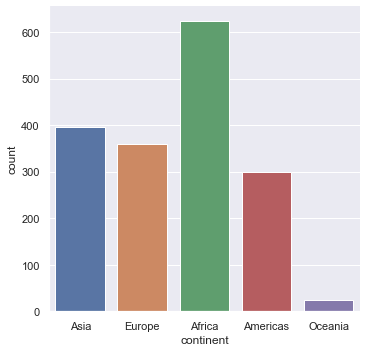


Note that generically seaborn generally looks like this.

sns.<command>(x=<column name>, y=<another column name>, ... , data =< a data frame>)

We use countplot here to just count entries and plot them as a box plot. 

### Exercise

What happens if we do the following? 

```python
sns.countplot(x="Continent", data=gapminder)
```

What does that tell us?


## Printing out 

You can save a figure as a PNG or as a PDF then in the same cell as the command you run to plot use the **savefig** command.

```python
sns.countplot(x="continent", data=gapminder)
plt.savefig("Histogram.png")
plt.savefig("Histogram.pdf")
```

## Looking at 1-d distributions

We can use the command **catplot** to just look at the distribution of life expenctancies.

```python
sns.catplot(y="lifeExp", data=gapminder)
```

You should get something like this.


The points are *jittered* i.e. randomly moved in the horizontal axis to make things clearer. We can switch that off if we wish. 

```python
sns.catplot(y="lifeExp", data=gapminder,jitter=False)
```


This scatterplot is not very informative! We can create a box plot of the data

```python
sns.boxplot(y="lifeExp", data=gapminder)
```

This should give the following. 


### Exercise

One can use another type of plot called a *violin* plot which tries to summarise the distribution better than a boxplot. The width of the violin plot represents how big the distribution is at that value. It is quite useful for picking out multi-modal (one with a distribution that has more than one peak). The command in seaborn is violinplot. Try and implement this for this data. 


## Diving deeper into the data

Just looking at the life expectancy for all of the countries isn't very informative. The first thing we can do is ask how does this vary across continents. Seaborn does this easily by introducing an x-axis which is the continent. Again, let's try with just the points.   

```python
sns.catplot(x="continent", y="lifeExp", data=gapminder)
```


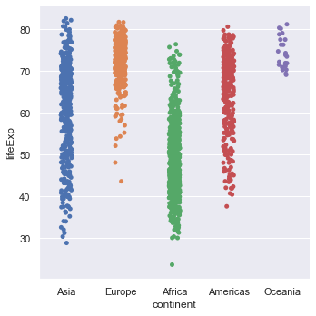

### Exercise

1. Repeat this using box plots (and violin plots if you wish).
2. Repeat the above steps using GDP per capita (gdpPercap) instead of life expectancy.
3. You can also try the **swarmplot** function as another way to represent this data.


Can we just draw a distribution or a histogram? What about dividing it as continents? Yes! But we'll get to that in a bit.

## Ordering

Plotting the box plots with the continents in alphabetical order is quite easy. 


```python
orderedContinents = sorted(list(set(gapminder.continent)))
orderedContinents
```

orderedContinents is a list with the continents ordered.


```python
sns.boxplot(x="continent", y="lifeExp", order=orderedContinents, data=gapminder)
```


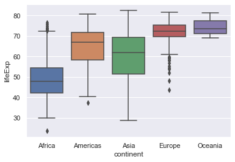


On the other hand we may want to order the box plots in ascending order of the medians of the life expectancy. This is more involved but is a good exercise in manipulating the data.

```python
#Create an empty dictionary
medianLifeExps = {}
# Loop through all the continents
for val in gapminder.continent:
  # Create a new key which is the median life expectancy of that continent
  # gapminder[gapminder.continent == val] pulls out the continent in that loop
  # the .lifeExp.median() part then computes the median 
  # of the remaining life expectancy data
    key = gapminder[gapminder.continent==val].lifeExp.median()
  # create a new entry in the dictionary with the continent as the value and the key 
  # as the median.
    medianLifeExps[key] = val   
# Create a sorted list of the medians (in ascending order)    
sortedKeys = sorted(medianLifeExps)
# Finally return the list of continents in that order
orderedMedianContinents = []
for m in orderedMedians:
    orderedMedianContinents.append(medianLifeExps[m])
```


```python
sns.boxplot(x="continent", y="lifeExp", order=orderedMedianContinents, data=gapminder)
```


### Exercise

Do the same plot for GDP per capita.


## Line and scatter plots

Instead of having a categorical variable on the horizontal access we now do scatter and line plots. Let's start with the whole data set.

```python
sns.scatterplot(x="gdpPercap",y="lifeExp",data=gapminder)
```


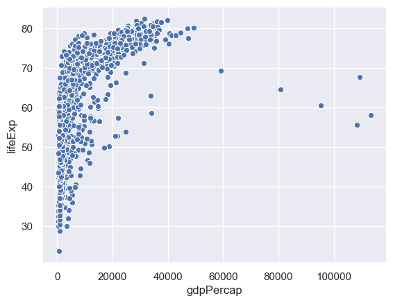

This is hard to grasp as a whole, so we'll just consider one country - China. 

We can select data corresponding to China by the following.

 gapminder[gapminder.country=="China"]

```python
sns.scatterplot(x="gdpPercap",y="lifeExp",data= gapminder[gapminder.country=="China"])
```


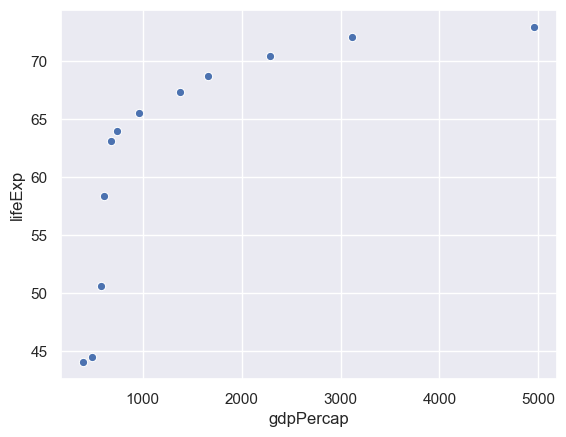

### Exercise

Do the same for your country - if it isn't listed in gapminder then pick another.

A line plot works in the same way. It's possible to overlay these in the same cell. 

```python
sns.lineplot(x="gdpPercap",y="lifeExp",data= gapminder[gapminder.country=="China"])
sns.scatterplot(x="gdpPercap",y="lifeExp",data= gapminder[gapminder.country=="China"])
```


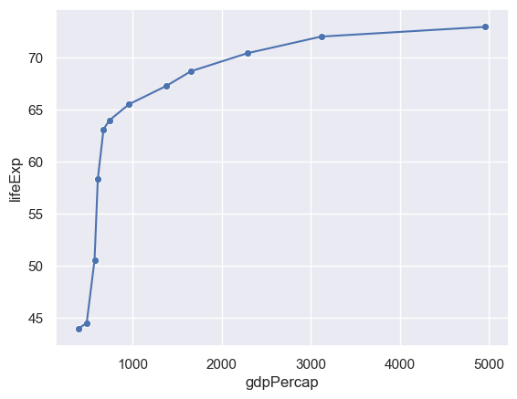

## Expressing more variables with different attributes

It is hard to make out the points from the lines. We can change the colour (color) of the points accordingly.

```python
sns.lineplot(x="gdpPercap",y="lifeExp",data= gapminder[gapminder.country=="China"])
sns.scatterplot(x="gdpPercap",y="lifeExp",color="red",data= gapminder[gapminder.country=="China"])
```


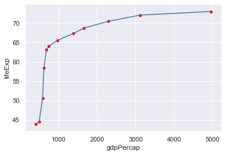

We can use the colour of the points to represent a different column - e.g. the year. 

```python
sns.lineplot(x="gdpPercap",y="lifeExp",data= gapminder[gapminder.country=="China"])
sns.scatterplot(x="gdpPercap",y="lifeExp",hue="year",
                data= gapminder[gapminder.country=="China"])
```


The problem here is that only a certain number of years have been picked out. We need to tell seaborn how  many years there are and how to set a palette of colours for this (the default palette has six colours).

```python
# Find the number of years (why only set?)
n = len(set(gapminder.year))
sns.lineplot(x="gdpPercap",y="lifeExp",data= gapminder[gapminder.country=="China"])
# We use a rainbow-like palette but there are others.
sns.scatterplot(x="gdpPercap",y="lifeExp",hue="year",palette=sns.color_palette("rainbow_r",n), data= gapminder[gapminder.country=="China"])

```


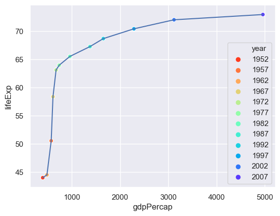

We can use the size of the point to represent an additional column - the population.


```python
n = len(set(gapminder.year))
sns.lineplot(x="gdpPercap",y="lifeExp",data= gapminder[gapminder.country=="China"])
sns.scatterplot(x="gdpPercap",y="lifeExp",hue="year",size="pop", 
                palette=sns.color_palette("rainbow_r",n),
                data= gapminder[gapminder.country=="China"])
```


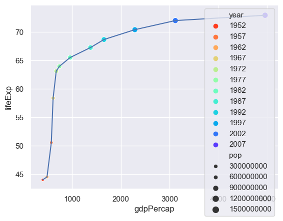

The problem now is that there is too much detail in the legend - so we'll switch that off. 

```python
n = len(set(gapminder.year))
sns.lineplot(x="gdpPercap",y="lifeExp",data= gapminder[gapminder.country=="China"])
sns.scatterplot(x="gdpPercap",y="lifeExp",hue="year",size="pop", 
                palette=sns.color_palette("rainbow_r",n),
                data= gapminder[gapminder.country=="China"],
               legend=False)
```


How useful is adding these attributes?

### Exercise

Pick another country and try this out. Costa Rica is interesting. Does anybody have an explanation? 


## Summarising

We will now examine how life expenctancy has varied over time. 

```python
sns.lineplot(x="year",y="lifeExp",hue="country",data= gapminder,legend=False)
```


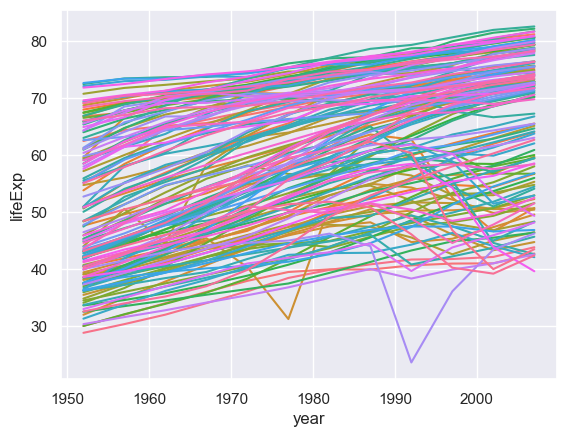

There are so many countries here I haven't even tried to construct a palette! Looking at this many countries are generally increasing but some are not following that trend. We could explore those outliers but here we will focus on trying to summarise what is going on (is a particular continent not going with the trend of increasing life span over time?)

To do this we need to use another pandas command **groupby** which creates a new data frame for particular variables. Once we have created that new data frame we can then plot the data. 

```python
# First create a new data frame which has the medians, by year and continent, of the life expectancy 
medianGapminder = gapminder.groupby(['continent','year']).lifeExp.median()
# Now plot it
sns.lineplot(x="year",y="lifeExp",hue="continent",data= medianGapminder)
```


What happened? The groupby command makes continent and year *indices* of the data (you can see this if you print out the data frame). Having created the data frame we need to reset the indices. 


```python
# First create a new data frame which has the medians, by year and continent, of the life expectancy 
medianGapminder = gapminder.groupby(['continent','year']).lifeExp.median()
# Now plot it
sns.lineplot(x="year",y="lifeExp",hue="continent",data= medianGapminder.reset_index())
```


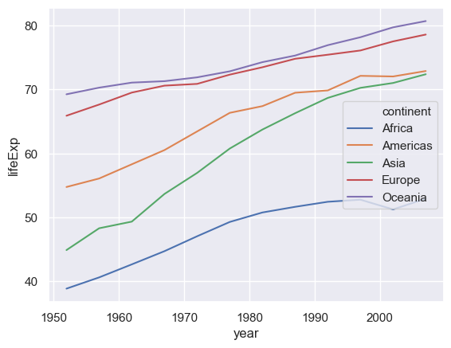

### Exercise

1. Repeat this using the GDP per capita.

2. Use a different statistical summary apart from the median. 

   

## Regression

The line plots just "join the dots". It is more intesting to try and fit the data to a curve. We also want to do the fit and distinguish between the different continents. We can do this using the **lmplot** command.

```python
sns.lmplot(x="year",y="lifeExp",hue="continent", data= medianGapminder.reset_index())
```


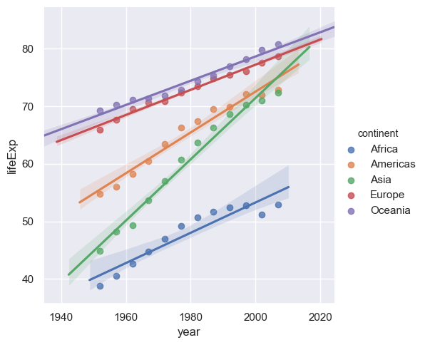

This does a simple linear regression. We can do more sophisticated types of fit, for example Loess (or Lowess).

```python
sns.lmplot(x="year",y="lifeExp",hue="continent", lowess=True, data= medianGapminder.reset_index())
```


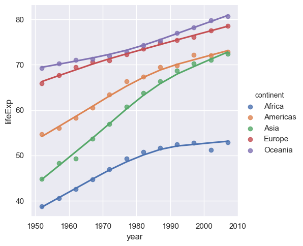

### Exercise

Repeat the above using the GDP per capita.


## More regression

Now that we know how to fit curves through data with a number of different variables we can go back to the case of where we plotted the life expectancy against the GDP per capita. Instead of just doing a scatter plot we can now do regression (curve fitting) as function of the continent as well so we can see how the life expectancy varies between GDP per capita and the continent.

```python
sns.lmplot(x="gdpPercap",y="lifeExp",hue="continent", lowess=True,data=gapminder)
```


The problem here is that points are too large - we cannot see the trend. When you have many points make the point size smaller, indeed way smaller (someone described it as 'dust size') to see the trend better. Since Seaborn is based on Matplotlib we need to use a slightly different notation in the arguments to what was used previously.


```python
# scatter_kws is passed onto the underlying matplotlib plotting routine.
sns.lmplot(x="gdpPercap",y="lifeExp",hue="continent", lowess=True,data=gapminder,scatter_kws={"s":5})
```


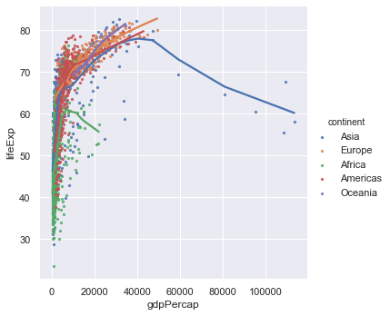


The GDP per capita varies over a wide range and it would be good in the first instance to plot the x-axis on a logarithmic scale. Again since Seaborn is based on Matplotlib we need to use a slightly different notation to what was used previously.


```python
ax = sns.lmplot(x="gdpPercap",y="lifeExp",hue="continent", lowess=True, data=gapminder,scatter_kws={"s":5})
ax.set(xscale="log")
```


We now get a much better spread of the data but it's still hard to see how the different continents are behaving. To do that we make use of **facet plots**. These are simply plots of different but related variables that are organised on the same screen for easy comparison.

```python
ax = sns.lmplot(x="gdpPercap",y="lifeExp",col="continent", lowess=True, data=gapminder,scatter_kws={"s":5})
ax.set(xlim=(100,200000),xscale="log")
```


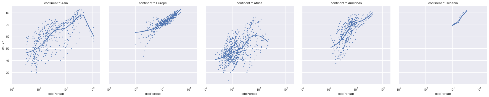


We note that the axes of all of these plots are the same so we can do a valid comparison. Still these plots are quite squashed as thy try and fit to the width of the page. Instead we can wrap them around. 

```python
ax = sns.lmplot(x="gdpPercap",y="lifeExp",col="continent", 
                col_wrap=2,
                lowess=True, data=gapminder,scatter_kws={"s":5})
ax.set(xlim=(100,200000),xscale="log")
```


Finally, we can adjust the colour of the individual plots.

```python
ax = sns.lmplot(x="gdpPercap",y="lifeExp",col="continent", hue="continent",
                col_wrap=2,
                lowess=True, data=gapminder,scatter_kws={"s":5})
ax.set(xlim=(100,200000),xscale="log")
```


### Exercise

Do the same type of plots for life expectancy against year.

## Distributions

We can plot the distribution of a list of data (one column from a data frame) using a kernal density approach and/or a histogram.

```python
sns.distplot(gapminder.lifeExp)
```

**distplot** only allows a single column from a data frame!


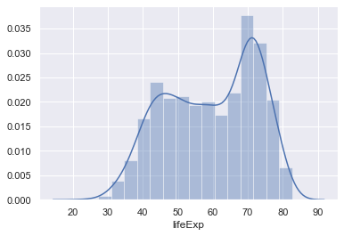

You can also add the raw data into this plot as well (although this isn't very useful in this case as there's so much data).

```python
sns.distplot(gapminder.lifeExp,rug=True)
```


### Exercise

Do the same type of plot with the GDP per capita data.


Again we would like to break this down in separate continents. Again we will make use of facet plots. **lmplot** is designed to create facet plots but **distplot** isn't so we need to use a specific function called **FacetGrid** to do this. In the call below we also adjust the height and aspect (the height/width ratio) of the figures. 

```python
# Create a facet of the gapminder data based on the continents ordered alphabetically (orderedContinents)
g = sns.FacetGrid(gapminder, row="continent", row_order=orderedContinents,
                  height=2, aspect=4)
# Plot on the facets the distribution of the life expctancy data, but don't plot the histogram.
g.map(sns.distplot, "lifeExp", hist=False)
```


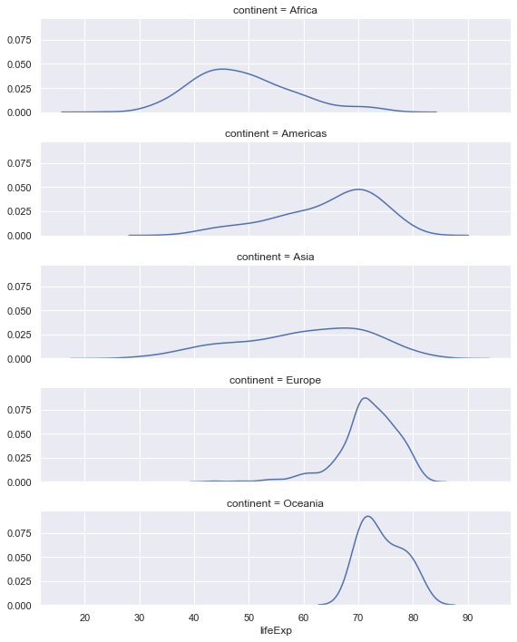

Finally the facet plot can also be used with just one facet!

```python
# Create a facet plot with one facet but colour on continent.
g = sns.FacetGrid(gapminder, hue="continent",height=2, aspect=4)
# Plot the distributions with no histogram
g.map(sns.distplot, "lifeExp", hist=False)
# Give the colour scheme in a legend
g.add_legend()
```


### Exercise

- Do the same type of plot with the GDP per capita data
- (Longer) Select the data from the gapminder data set for a particular continent and now create facet plots for those countries.