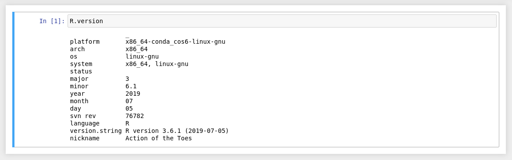

# Instructions for creating a *Jupyter Notebook Server* in a *IaaS* system


## Prerequisites: 
   * The software that will allow you to connect to your VM. This is called _Terminal_ and installed by default on a Mac. If you are on a Windows based machine, you should use an appropriate terminal software. I suggest PuTTY for new users. 
   * Your OpenStack SSH Key created in lesson 2.
   * The IP Address of your VM from lesson 2. 

**Notes on syntax:**
   * If you see ```text like this``` it is a command to enter directly into your terminal (it can be cut and pasted).
   * If you see a ```%``` or ```$``` character before ```text like this``` it represents the prompt and should not be part of your text. Don't cut and paste this character!
   * If something is in brackets like ```<This_Text>``` it needs your unique text and should be replaced with the appropriate value.

**A Final Note:**
   * Hopefully the UNIX session you've completed covers most of the commands you see here. If it did not and you're curious, ask your instructor.  

### Connecting via SSH
   * Open your terminal software and navigate to the directory where you've saved your OpenStack SSH Key. 
   * Your key will not work if it's permission is not set correctly. This is a security precaution. Use this command to hide your key from anyone but yourself: <br>
   ```% chmod 400 <Your_Key_File>```
   * Connect to your VM using: <br>
   ```% ssh -i <Your_Key_File> ubuntu@<Your_IP_Address>```
   * The first time you log on you will be presented with the question: <br>
   ```Are you sure you want to continue connecting (yes/no/[fingerprint])?```
   * Answer ```yes```. 
   * You are now connected to your VM. You will see a prompt like this: <br>
   ```ubuntu@testvm1:~$```

### Preparing the OS for Software Installation
   * We created the Ubuntu Virtual Machine using a pre-packaged image. We want to be sure it has all the latest software versions. We do this by running this command: <br>
   ```$ sudo apt update && sudo apt -y upgrade```
   * This step will take about 3 minutes. You can watch all the updated packages being installed in the terminal. When it is done you will see this as the final line: <br>
   ```$ update-initramfs: Generating /boot/initrd.img-5.4.0-74-generic```
   * install the base fonts into the sysytem
    ```$ sudo apt install fontconfig```

Our next step would be to install the *conda environment manager* tool.

### Installing `conda` environment manager


For this hands-on we are going to use the [conda environment manager](https://docs.conda.io/en/latest/). This is a dependency and environment management for any language—Python, R, Ruby, Lua, Scala, Java, JavaScript, C/ C++, FORTRAN, and more.

The first thing that we need to make sure before installing the *conda environment manager* is that we are connected to our VM. So, your command line prompt should look like what was shown in the previous section.

#### 1. Download the ***miniconda*** distribution of conda

The *conda environment management* tool only allows us to create virtual environments completely separated from the operating system.
The tool is available for downloading in two flavors:
* ***Miniconda***: Minimal package containing only the basic softwares/packages. This will be the version that we are going to use during this hands-on; 
* ***Anaconda***: Maximal package containing most of the libraries/software used for doing data analysis;


We are going to use the *unix-shell* `wget` command for downloading stuff from the web. From the conda webpage we copied the download link  for the [latest version for linux](https://repo.anaconda.com/miniconda/Miniconda3-latest-Linux-x86_64.sh):

```bash=
$ wget https://repo.anaconda.com/miniconda/Miniconda3-latest-Linux-x86_64.sh
```

When the download is finished you should see the message:

```
2021-07-01 18:06:28 (19.9 MB/s) - ‘Miniconda3-latest-Linux-x86_64.sh’ saved [94235922/94235922]
```

#### 2. Change permissions and run the ***miniconda installer***

The unix file system allows us to define access permissions in 3 levels for files, the **owner**, the **group the owner belongs to**, and **every other users**. We are going to add permissions to the owner to execute the installer (using the `chmod` command). For more details on linux permissions please refer to [this link](https://wiki.archlinux.org/title/File_permissions_and_attributes).

```bash=
$ chmod 764 Miniconda3-latest-Linux-x86_64.sh
```

After changing the file permissions we can move on to the installation process itself. To run the installer we just need to use the command:

```bash=
$ ./Miniconda3-latest-Linux-x86_64.sh
```

The installer will ask you to access the license terms and afterwards will ask where the *miniconda* will be installed. We can accept the default value: `/home/ubuntu/miniconda3`. 

At the end of the installation you will be asked if you want to perform the `conda init` operation. This is responsible for adding the `conda` command line tool to our VM path. We should answer `yes` to this question. Now we have to log out and log in again before using the `conda` command.
To exit our VM we use the `exit` command. After disconnecting from the machine, we need to run the `ssh` command to access it again:

```bash=
$ exit
$ ssh -i <Your_Key_File> ubuntu@<Your_IP_Address>
```

If the installation was successful then you should see the new prompt similar to the following:

```bash=
(base) ubuntu@testvm1:~$
```


### Creating the virtual environment using the `conda` command

Now we need to create our virtual environment to install the *jupyter server*. We are going to call this environment `jupyter`:

```bash=
$ conda create -n jupyter
```

We can list the environment by typing the `conda env list` command:

```bash=
$ conda env list
```
The output should look like this: 
```
# conda environments:
#
base                  *  /home/ubuntu/miniconda3
jupyter                  /home/ubuntu/miniconda3/envs/jupyter
```

Now we are going to *activate* the `jupyter` environment:
```bash=
$ conda activate jupyter
```
The prompt should change to:
```bash=
(jupyter) ubuntu@testvm1:~$
```
If your prompt changed then the environment was correctly created and it is activated.

### Installing the *Jupyter Notebook Server*, the *R Kernel*, and extra libraries

Now that we are inside our `jupyter` environment we need to install the *notebook server* and also the [jupyter R kernel](https://github.com/IRkernel/IRkernel).

After activating the *jupyter* environment we are going to use the `conda install` command to install the *jupyter server*. The packages needed are 

1. `notebook`
2. `r`
3. `r-irkernel`

We can install all the needed software at once by performing the command:

```bash=
$ conda install notebook 
$ conda install r 
$ conda install r-irkernel
```
We can check if the notebook was correctly installed by using the `conda list` command combined with the `grep` command:

```bash=
$ conda list | grep notebook
```
The result should be:

```
notebook                  6.4.0            py39h06a4308_0  
```

### Launching the *Jupyter Notebook Server* and accessing its web interface

Now we are finally ready to launch the *Jupyter server*, but before running it we need to address a bug with the `irkernel` package and the Ubuntu 20.04. We need to install the the `libxrender1` library. We do that by using the `apt` command together with the `sudo` command that allows us to run commands as the system administrator:

```bash=
$ sudo apt install libxrender1
```

After installing the library we can start our *jupyter server*. One of the parameter needed for starting the server is the the IP address of the VM. That address is the same we used in the `ssh` command and has the format: `xxx.xxx.xxx.xxx`. That information is available inside the ***Instances*** tab at the *openstack* webpage. The command to start the server then should be:

```bash=
$ jupyter notebook --ip=<Your_IP_Address>
```

If you can see the following message, it means that the installation worked:

```
 To access the notebook, open this file in a browser:
     file:///home/ubuntu/.local/share/jupyter/runtime/nbserver-19589-open.html
 Or copy and paste one of these URLs:
     http://<Your_IP_Address>:8888/?token=2a3df1887c3a9acc7aa81673c348d3d205d220a81ec99788
  or http://127.0.0.1:8888/?token=2a3df1887c3a9acc7aa81673c348d3d205d220a81ec99788

```
The line containing the `<Your_IP_Address>` address will be the one that we should use to access our *jupyter server*. We just need to copy the whole line and paste it into a web browser. The interface that you will see is show at the figure bellow:


Now we can either upload one of the notebooks that we worked during the previous exercises (for this, use the ***Upload*** button at the top right of the page); or we can create a notebook from scratch. For this, access the drop down menu to check what kernels are installed on the server. If our R installation worked we should be able to see both *python* and *R* *kernels*:


Lets create an R notebook and check if the installation worked by running a `R.version` command:



Now you can go ahead and try to run one the analysis developed for the previous exercises.


### Cleaning up

If you want to remove all the software that we've installed we should first stop the *jupyter notebook server* by hitting `Control+c` and answering yes (`y`) when asked if you want to stop the server.

After that we need to deactivate the virtual environment `jupyter` before removing it:
```bash=
$ conda deactivate
```
The prompt should switch its prefix to `(base)`. Now we can use the `conda env remove` with the `-n` option to specify which environment should be deleted:

```bash=
$ conda env remove -n jupyter
```
