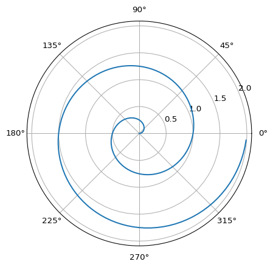

# Data Trieste 2023 - Author Carpentry
Marcela Alfaro Cordoba, Ph.D.Bianca Peterson, Ph.D.

## Schedule

- **Thursday 14:00 - 16:00 - [Workshop Reproducible
  Writing](https://CODATA-RDA-DataScienceSchools.github.io/Materials/blob/master/docs/DataTrieste2023/Quarto/AuthorCarpentry.html):**

  - Scientific writing in useful, powerful, and open mark-up languages
    such as Markdown in Quarto.

  - Formulating and managing citation data, publication lists, and
    bibliographies in open formats such as BiBTeX, JSON, XML and using
    open source reference management tools such as JabRef and Zotero.

  - Demonstrating best practices in attribution, acknowledgement, and
    citation, particularly for non-traditional research outputs
    (software, data sets).

- **Thursday 16:30 - 17:00 - Group Activity: Publishing workflow**

  - Crediting authorship, contributorship, and copyright ownership in
    collaborative research projects.

  - Ethics Exercise.

- **Thursday 17:00 - 18:00 - Talk I**

  - “How to avoid ‘predatory’ journals” - [Andy
    Nobes](https://www.inasp.info/staff/andy-nobes-0)

## Set Up

1.  What is ORCiD and why do you need one?
    - Watch [this video](https://vimeo.com/97150912).
2.  How to create your ORCiD?
    - Instructions to create one:
      [here](https://authorcarpentry.github.io/orcid-profile/00-orcid-profile.html).
    - Instructions to populate ORCiD:
      [here](https://authorcarpentry.github.io/orcid-profile/01-adding-works.html).
    - Already have it? Connect it with Science Open (if you want)
      [here](http://blog.scienceopen.com/2016/06/orcid-integration-at-scienceopen/).
3.  Does Quarto run on our computers? Do we have R and RStudio working
    on our computers?

### Test Activity

Please complete these activities on the same computer you are going to
use on Thursday. Let me know if there’s something that is not working
before then.

1.  Open RStudio.
2.  Click **File** \> **New File** \> **Quarto Document**.
3.  Type a title for your Quarto document and click **Create**.
4.  Click the **Render** button and name the file as `report.qmd`.

A `report.html` document will be generated in your working directory
that includes both content and the output of embedded code.

You can embed code like this:

``` {r}
1 + 1
```

You can add options to executable code like this

``` {r}
#| echo: false
2 * 2
```

The `echo: false` option disables the printing of code (only output is
displayed).

Also, it will include the output from this Python code:

``` python
import numpy as np
import matplotlib.pyplot as plt

r = np.arange(0, 2, 0.01)
theta = 2 * np.pi * r
fig, ax = plt.subplots(
  subplot_kw = {'projection': 'polar'} 
)
ax.plot(theta, r)
ax.set_rticks([0.5, 1, 1.5, 2])
ax.grid(True)
plt.show()
```



Didn’t work? Try following these instructions on how to install Jupyter,
numpy, nbformat and matplotlib:
<https://quarto.org/docs/computations/python.html>

If it doesn’t work, please let us know!
