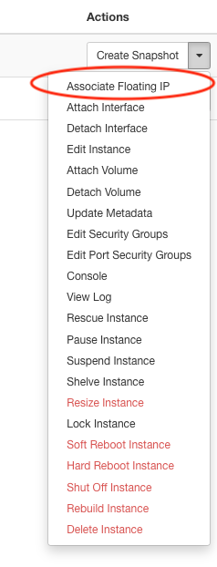
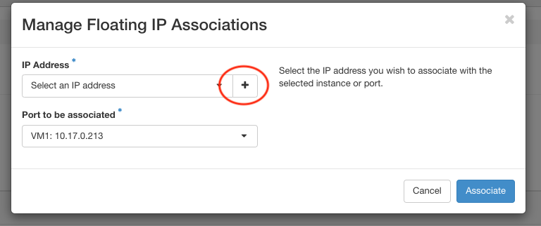
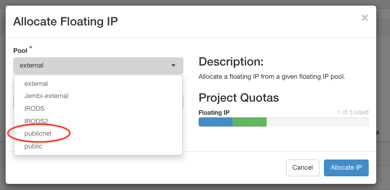
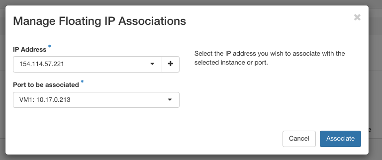

# Connect to Your OpenStack VM and prepare it for installing the Jupyter Notebook

Prerequisites: 
   * The software that will allow you to connect to your VM. This is called _Terminal_ and installed by default on a Mac. If you are on a Windows based machine, you should use an appropriate terminal software. I suggest [Git Bash](https://git-scm.com/downloads) for new users. 
   * Your OpenStack SSH Key created in lesson 2.
   * The IP Address of your VM from lesson 2. 

**Notes on syntax:**

   * If you see ```text like this``` it is a command to enter directly into your terminal (it can be cut and pasted).
   * If you see a ```%``` or ```$``` character before ```text like this``` it represents the prompt and should not be part of your text. Don't cut and paste this character!
   * If something is in brackets like ```<This_Text>``` it needs your unique text and should be replaced with the appropriate value.

**A Final Note:**
   * Hopefully the UNIX session you've completed covers most of the commands you see here. If it did not and you're curious, ask your instructor.  

## Allocating an IP (Internet Protocol) address to your virtual machine

In order to allocate a real Internet Address to the virtual machine we've just
created we have to use a feature named `Floating IP`. This feature selects an
address from the pool of available addresses and allocate such address to you
virtual machine. This is an important step, since the number of available IP
addresses is finite. 
This is done by accessing the drop down menu beside the `Create Snapshot`
button at the list of virtual machines. Make sure that your accessing this menu
for the Virtual Machine that you've just created. The option we will use is the
`Associate Floating IP` as can be seen in the picture:
<center></center>

After selecting that option you should see the following window. You should
select the plus sign:

<center></center>

In the next window, in the dropdown menu, select the `publicnet` and click on
the `Allocate IP` button. 

<center></center>

You will be redirected to the previous screen. It should look like this:

<center></center>

You should select the `Associate` button. The list of instances should display
your recently created Virtual Machine and under the _IP Addresses_ column you
should see two entries. We will use the address starting with the `154.114` to
access our virtual machine (we will refer to this as `Your_IP_Address`).

## Connecting via SSH
   * Open your terminal software and navigate to the directory where you've saved your OpenStack SSH Key. 
   * Your key will not work if it's permission is not set correctly. This is a security precaution. Use this command to hide your key from anyone but yourself: <br>
   ```% chmod 400 <Your_Key_File>```
   * Connect to your VM using: <br>
   ```% ssh -i <Your_Key_File> ubuntu@<Your_IP_Address>```
   * The first time you log on you will be presented with the question: <br>
   ```Are you sure you want to continue connecting (yes/no/[fingerprint])?```
   * Answer ```yes```. 
   * You are now connected to your VM. You will see a prompt like this: <br>
   ```ubuntu@robtest4:~$```

## Preparing the OS for Software Installation
   * We created the Ubuntu Virtual Machine using a pre-packaged image. We want to be sure it has all the latest software versions. We do this by running this command: <br>
   ```$ sudo apt update && sudo apt -y upgrade```
   * This step will take about 3 minutes. You can watch all the updated packages being installed in the terminal. When it is done you will see this as the final line: <br>
   ```$ update-initramfs: Generating /boot/initrd.img-5.4.0-74-generic```


[Return to CI Overview](00-Hands_on_Exercise_Overview.md)
