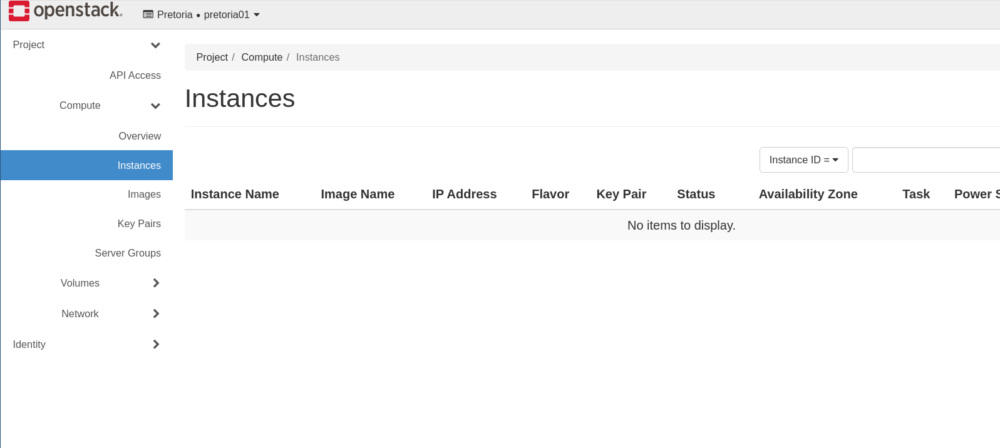
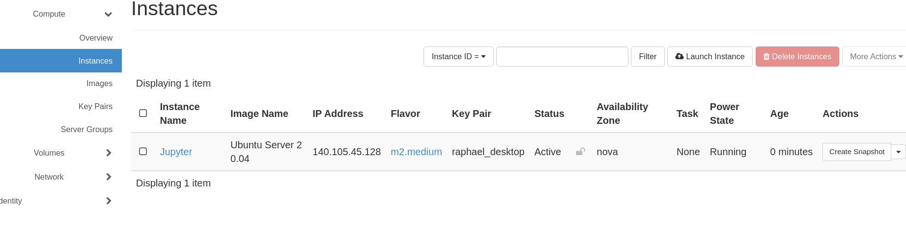
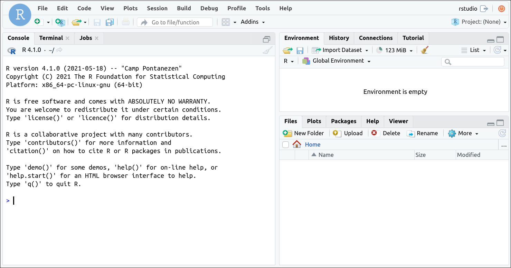

# Instructions for creating a *Jupyter Notebook Server* in a *IaaS* system by using a container service

### Creating the Virtual Machine in *Openstack*
Before installing and configuring the *Jupyter Notebook Server* we need to allocate the server at which the service will run. For this example we assume that we are using the *Openstack* cloud manager web interface (*Horizon*)

#### 1. Instantiating the Virtual Machine

For instantiating a new VM, we should head to the ***Instances*** menu item as show in the image bellow: 



After that we are going to create a new VM by clicking at the *Launch Instances*
For the instance creation we are going to use the following parameters:
* **Instance Name**: Jupyter
* **Source**:
    * Select `Image`  under the *Select Boot Source* menu;
    * Select `No` under the *Create New Volume* option;
    * Select the `Ubuntu Server 20.04` for booting;
* **Flavor**: Select the `m2.medium` flavor;
* **Key Pair**: Select the *Key Pair* generated in previous exercises that should be stored at you `Desktop` directory (the file should be named `id_rsa`);

Now we are ready to create the VM by accessing the *Launch Instance* button.
The instance is ready to be used when we see the *Active* status and the ***Power State*** set to *Running*.

For more details on how to create a VM, please refer to [Exercise 2](02-Create_A_VM.md)

#### 2. Accessing the VM
We are going to use the [ssh protocol](https://en.wikipedia.org/wiki/Secure_Shell_Protocol) to access the VM. 
Before accessing the machine we have to find its IP address at the Openstack interface. Under the ***Instances*** tab we should see the *Jupyter* VM. As seen in the image below:



For more information about how to connect to the VM that we've just created please review the [Exercise 3](03-Connect_And_Install.md).
<!--


The IP address for the machine will be available under the `IP Address` column. The number should have the following format `xxx.xxx.xxx.xxx`.

Now that we know the access, we need to open a Terminal and type the following commands:
 
```bash=
$ ssh -i ~/Desktop/id_rsa ubuntu@xxx.xxx.xxx.xxx
```
In this command, the `ubuntu` part before the `@` sign is the name of the user that we going to use to connect to the VM. The `ubuntu` user is the default. The `-i ~/Desktop/id_rsa` part of the command specifies the *private key* that we are going to use to connect to the remote VM. 
For this step we assume that you have already created the private key and stored it in you *Desktop* folder, also that your *Desktop* folder is stored inside you *home directory*.

If this is the first time that you are accessing this virtual machine you will see the following message:
```
The authenticity of host '140.105.45.128 (140.105.45.128)' can't be established.
ECDSA key fingerprint is SHA256:Colnagsodf3XnvDSYIq3mHSei2+zooyBZD+XzuviG3o.
Are you sure you want to continue connecting (yes/no)? 
```
This is a security measure and you should accept it by typing `yes`. For further information about this you can read [this link](https://scriptingosx.com/2017/07/ssh-keys-part-1-host-verification/).
-->

Once you've managed to connect to the VM you should the following prompt (assuming that you've used ***Jupyter*** as the VM name during the creation):

```bash=
ubuntu@jupyter:~$
```

Our next step would be to install the *conda environment manager* tool.

### Installing `docker` container service


For this hands-on we are going to use [Docker](https://www.docker.com/). This is the most popular container engine on the market.

The first thing that we need to make sure before installing the *docker* service is that we are connected to our VM. So, your command line prompt should look like what was shown in the previous section.

The following instructions were taken from the [Docker documentation](https://docs.docker.com/engine/install/ubuntu/).

Before you install Docker Engine for the first time on a new Ubuntu machine, you need to set up the Docker repository. Afterward, you can install and update Docker from the repository.

#### 1. Set up the repository
Update the apt package index and install packages to allow apt to use a repository over HTTPS:
```bash=
$ sudo apt-get update
$ sudo apt-get install \
   apt-transport-https \
   ca-certificates \
   curl \
   gnupg \
   lsb-release
```
Add Docker’s official GPG key:

```bash=
$ curl -fsSL https://download.docker.com/linux/ubuntu/gpg | sudo gpg --dearmor -o /usr/share/keyrings/docker-archive-keyring.gpg
```
This command will not generate any output.

Now we are going to add a new source of programs that can be installed to our ubuntu machine. 

```bash=
$ echo \
 "deb [arch=amd64 signed-by=/usr/share/keyrings/docker-archive-keyring.gpg] https://download.docker.com/linux/ubuntu \
  $(lsb_release -cs) stable" | sudo tee /etc/apt/sources.list.d/docker.list > /dev/null
```

#### 2. Install Docker Engine

Update the apt package index, and install the latest version of `Docker Engine` and `containerd`:

```bash=
$ sudo apt-get update
$ sudo apt-get install docker-ce docker-ce-cli containerd.io
```

#### 3. Manage Docker as a non-root user
The Docker background Service, by default needs administrator privileges  and other users can only access it using `sudo`. If you don’t want to preface the docker command with `sudo`, we need to create a new group called `docker` and add users to it. 

To create the docker group and add your user:
1. Create the docker group.
```bash=
$ sudo groupadd docker
```
If you receive the message that informs that the *docker* group already exists then, just go to the next step.

2. Add your user to the docker group.
```bash=
$ sudo usermod -aG docker ubuntu
```

After adding your user to the `docker` group we need to log out and log in back again in order to our changes take effect.

3. Verify that you can run docker commands without sudo.
```bash=
$ docker run hello-world
```

You should see the following message:

```
Unable to find image 'hello-world:latest' locally
latest: Pulling from library/hello-world
b8dfde127a29: Pull complete 
Digest: sha256:9f6ad537c5132bcce57f7a0a20e317228d382c3cd61edae14650eec68b2b345c
Status: Downloaded newer image for hello-world:latest

Hello from Docker!
This message shows that your installation appears to be working correctly.

To generate this message, Docker took the following steps:
 1. The Docker client contacted the Docker daemon.
 2. The Docker daemon pulled the "hello-world" image from the Docker Hub.
    (amd64)
 3. The Docker daemon created a new container from that image which runs the
    executable that produces the output you are currently reading.
 4. The Docker daemon streamed that output to the Docker client, which sent it
    to your terminal.

To try something more ambitious, you can run an Ubuntu container with:
 $ docker run -it ubuntu bash

Share images, automate workflows, and more with a free Docker ID:
 https://hub.docker.com/

For more examples and ideas, visit:
 https://docs.docker.com/get-started/
```

If you were able to see such message, it means that your *docker* installation worked. It also means that we just executed our first docker container.
It is not our intention to go into details on how docker works. For more details, please read the [docker documentation](https://docs.docker.com/get-started/overview/).


### Downloading the *jupyter r image* and running the container
From the docker documentation page we see the definition of images:

> An image is a read-only template with instructions for creating a Docker container. Often, an image is based on another image, with some additional customization. For example, you may build an image which is based on the ubuntu image, but installs the Apache web server and your application, as well as the configuration details needed to make your application run.

>You might create your own images or you might only use those created by others and published in a registry. To build your own image, you create a Dockerfile with a simple syntax for defining the steps needed to create the image and run it. Each instruction in a Dockerfile creates a layer in the image. When you change the Dockerfile and rebuild the image, only those layers which have changed are rebuilt. This is part of what makes images so lightweight, small, and fast, when compared to other virtualization technologies.


For this tutorial we will use the [r-notebook](https://hub.docker.com/r/jupyter/r-notebook) image provided by the jupyter project.

Since containers are completely isolated from the host machine, we need to let the host machine that there is a service inside the container running on an specific port (**8888** in this case) and that the host machine should redirect all connections coming to this port to the container. For that we will have to use the `-p` option of the `docker run` command:

```bash=
$ docker run -p 8888:8888 jupyter/r-notebook
```

You should see the following message:

```
... 
To access the notebook, open this file in a browser:
    file:///home/jovyan/.local/share/jupyter/runtime/nbserver-7-open.html
 Or copy and paste one of these URLs:
        http://0e2f5167d3df:8888/?token=63dff0320021dd61e6e2f137181d85630cd7d7c92d11f1a4
 or http://127.0.0.1:8888/?token=63dff0320021dd61e6e2f137181d85630cd7d7c92d11f1a4
```

We should select the `?token=63dff0320021dd61e6e2f137181d85630cd7d7c92d11f1a4` part and append it to the *http://xxx.xxx.xxx.xxx:8888/* where the `xxx.xxx.xxx.xxx` is the IP address of your VM. It should look like this: *http://xxx.xxx.xxx.xxx:8888/?token=63dff0320021dd61e6e2f137181d85630cd7d7c92d11f1a4*.

As we said before, the container is completely isolated from the host operating system. That means that the files that you create inside the container are not available inside the host file system. In order to share files between the host and the container we need to specify the `-v` option.

By default the jupyter server starts from the `/home/jovyan/work` inside the container. So, we are going to share a folder in our home directory named `share`. The command for starting the container with a directory mapping looks like: 

```bash=
$ docker run -p 8888:8888 -v /home/ubuntu/share:/home/jovyan/work jupyter/r-notebook
```

By mapping a directory at the host operating system we make sure that everything that we do inside our container that is saved at the shared folder will be available after the container is destroyed. 

### Running a docker container with the R studio server

RStudio also has a free [web version](https://www.rstudio.com/products/rstudio/#rstudio-server) that looks exactly like the one you've installed at you machine. 

We are going to use a container image that contains the installation of the RStudio server. [This docker image](https://hub.docker.com/r/rocker/rstudio) is not maintained by the RStudio developers, but it is of a good quality and safe to use. In order to start this we are going to perform the command:

```bash=
docker run -v /home/ubuntu/share:/app -p 8888:8787 -e PASSWORD=yourpasswordhere rocker/rstudio
```
In this case we are mapping the container network port **8787** to the host machine port **8888** (`-p`). That means that all traffic arriving at the port 8888 of the host machine is redirected to port 8787 in the container.

The RStudio server requires the definition of a password to access the web interface. We do that by using the `-e` option. That option is used to define system variables inside the container. In this case, the `PASSWORD` variable containing the password to access the web interface (the **default username** is **`rstudio`**). We have also mapped the `/home/ubuntu/share` directory to the `/app` directory inside the container. In order to access the RStudio server web interface we have to access the URL: *http://xxx.xxx.xxx.xxx:8888*, where `xxx.xxx.xxx.xxx` is the IP address to our Virtual Machine.

If everything worked then you should be able to see the following interface:




